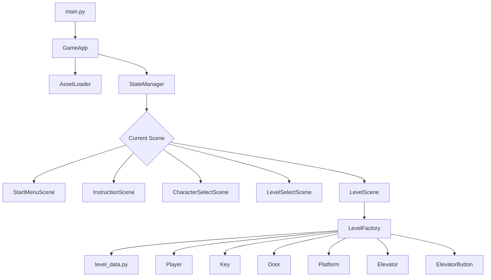
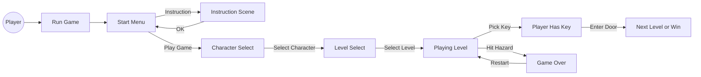
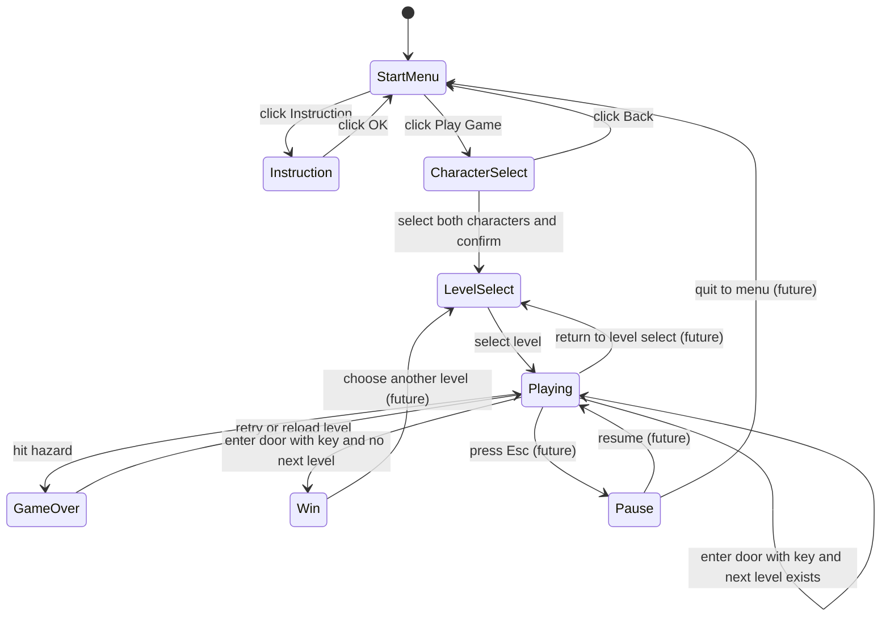
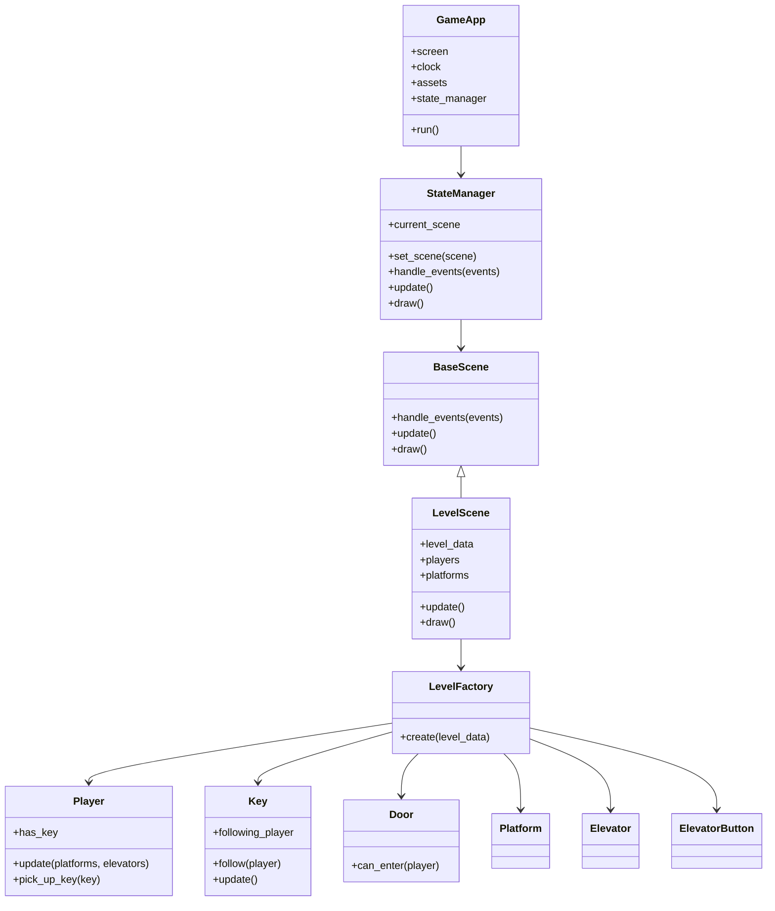

# System Overview And Use Cases

เอกสารนี้สรุปภาพรวมระบบของเกม Poonny Moony ในมุมมองการพัฒนา อธิบายว่าแต่ละส่วนของระบบทำงานร่วมกันอย่างไร มี use case การใช้งานแบบไหน และ DFA จำเป็นกับโปรเจกต์นี้หรือไม่

## ภาพรวมระบบ

Poonny Moony เป็นเกม 2D cooperative platformer ที่ใช้โครงสร้างแบบ scene-based game ระบบหลักเริ่มจาก `GameApp` แล้วส่งต่อการทำงานให้ `StateManager` เพื่อจัดการ scene ปัจจุบัน

โครงสร้างการทำงานหลัก:

```text
main.py
└── GameApp
    ├── AssetLoader
    ├── StateManager
    └── current Scene
        ├── StartMenuScene
        ├── InstructionScene
        ├── CharacterSelectScene
        ├── LevelSelectScene
        └── LevelScene
```

เมื่อเข้า `LevelScene` ระบบจะใช้ `LevelFactory` สร้าง object ในด่านจากข้อมูลใน `level_data.py`

```text
LevelScene
├── level_data
├── LevelFactory
└── Entities
    ├── Player
    ├── Key
    ├── Door
    ├── Platform
    ├── Elevator
    └── ElevatorButton
```

## Use Case หลักของระบบ

### 1. เริ่มเกม

Actor: ผู้เล่น

Flow:

1. ผู้เล่นรัน `python main.py`
2. `GameApp` สร้างหน้าต่างเกม
3. `StateManager` ตั้ง scene เริ่มต้นเป็น `StartMenuScene`
4. ผู้เล่นเห็นหน้าเมนูหลัก

ผลลัพธ์:

- เกมพร้อมรับ input จากผู้เล่น

### 2. ดูคำแนะนำการเล่น

Actor: ผู้เล่น

Flow:

1. ผู้เล่นอยู่ที่ `StartMenuScene`
2. คลิกปุ่ม `Instruction`
3. ระบบเปลี่ยนไป `InstructionScene`
4. ผู้เล่นอ่านคำแนะนำ
5. คลิก `OK` เพื่อกลับหน้าเมนูหลัก

ผลลัพธ์:

- ผู้เล่นเข้าใจกติกาพื้นฐานก่อนเริ่มเกม

### 3. เลือกตัวละคร

Actor: ผู้เล่น

Flow:

1. ผู้เล่นคลิก `Play Game`
2. ระบบเปลี่ยนไป `CharacterSelectScene`
3. ผู้เล่นคลิกเลือก Ice หรือ Lava
4. ระบบแสดงปุ่มควบคุมของผู้เล่น 1 และผู้เล่น 2
5. ผู้เล่นเลือกตัวละครให้ครบทั้ง 2 คน
6. ผู้เล่นกด `Confirm`
7. ระบบบันทึกค่าตัวละครที่เลือกไว้ใน `app.selected_players`
8. ระบบเปลี่ยนไป `LevelSelectScene`

ผลลัพธ์:

- ระบบมีข้อมูลตัวละครของผู้เล่น 1 และผู้เล่น 2
- ผู้เล่นเข้าสู่หน้าเลือกด่าน

หมายเหตุ:

ตัวละครที่เลือกจะถูกส่งไปใช้ตอน `LevelFactory` สร้างผู้เล่นในด่าน

### 4. เลือกด่าน

Actor: ผู้เล่น

Flow:

1. ผู้เล่นอยู่ที่ `LevelSelectScene`
2. คลิกปุ่มด่าน
3. ถ้าคลิกด่าน 1 ระบบสร้าง `LevelScene` ด้วย `LEVEL_1`
4. ถ้าคลิกด่าน 2 ระบบสร้าง `LevelScene` ด้วย `LEVEL_2`
5. ถ้าคลิกด่าน 3 ตอนนี้ยังไม่เชื่อมสมบูรณ์

ผลลัพธ์:

- ผู้เล่นเข้าสู่ด่านที่เลือก

### 5. เล่นด่าน

Actor: ผู้เล่น 1 และผู้เล่น 2

Flow:

1. `LevelScene` โหลดข้อมูลด่าน
2. `LevelFactory` สร้าง object ทั้งหมดในด่าน
3. ผู้เล่นควบคุมตัวละครด้วย keyboard
4. `Player` ตรวจ movement, gravity และ collision
5. `LevelScene` update key, button, elevator และตรวจเงื่อนไขแพ้/ชนะ
6. `LevelScene` draw object ทั้งหมดลงหน้าจอ

ผลลัพธ์:

- ผู้เล่นสามารถเล่นด่านได้ตามกติกา

### 6. เก็บกุญแจ

Actor: ผู้เล่น

Flow:

1. ผู้เล่นเดินชน `Key`
2. `Player.pick_up_key()` ตั้งค่า `has_key = True`
3. `Key` ตั้งค่าให้ตามผู้เล่นคนนั้น
4. ในแต่ละ frame `Key.update()` จะย้ายตำแหน่งกุญแจไปที่ตัวผู้เล่น

ผลลัพธ์:

- ผู้เล่นถือกุญแจ
- สามารถเข้าประตูเพื่อผ่านด่านได้

### 7. ใช้ลิฟต์

Actor: ผู้เล่น

Flow:

1. ผู้เล่นเดินไปเหยียบ `ElevatorButton`
2. `ElevatorButton` ตั้งค่า `is_pressed = True`
3. `LevelScene` ส่งสถานะปุ่มไปที่ `Elevator`
4. `Elevator` เคลื่อนที่ไปยัง `target_y`
5. เมื่อผู้เล่นออกจากปุ่ม ลิฟต์กลับตำแหน่งเดิม

ผลลัพธ์:

- ผู้เล่นใช้ลิฟต์เพื่อไปยังพื้นที่ที่เข้าถึงยาก

### 8. แพ้จาก hazard

Actor: ผู้เล่น

Flow:

1. ผู้เล่นชน hazard เช่น ลาวา
2. `LevelScene._check_hazards()` ตรวจพบ collision
3. ระบบแสดงข้อความ `Game Over`
4. ระบบโหลดด่านใหม่

ผลลัพธ์:

- ด่าน restart

### 9. ผ่านด่าน

Actor: ผู้เล่น

Flow:

1. ผู้เล่นที่ถือกุญแจเดินชน `Door`
2. `Door.can_enter()` คืนค่า `True`
3. ถ้ามีด่านถัดไป ระบบเปลี่ยนไป `LevelScene` ของด่านถัดไป
4. ถ้าไม่มีด่านถัดไป ระบบแสดง `Winner!` แล้วโหลดด่านใหม่

ผลลัพธ์:

- ผู้เล่นผ่านด่านหรือจบเกมตามข้อมูลที่ตั้งไว้

## สิ่งสำคัญที่ควรสร้างต่อ

### 1. Game Over Scene

ตอนนี้ Game Over ยังเป็นข้อความที่วาดใน `LevelScene` แล้ว reset ด่านทันที ควรแยกเป็น `GameOverScene`

ประโยชน์:

- กด retry ได้
- กดกลับเมนูได้
- เพิ่ม animation หรือเสียงได้ง่าย

### 2. Pause Scene

ควรเพิ่มระบบ pause เพื่อหยุดเกมชั่วคราว

Use case:

- ผู้เล่นกด `Esc`
- เกมหยุด update physics
- แสดงเมนู Resume, Restart, Quit

### 3. Level 3 Integration

ตอนนี้ด่าน 3 ยังไม่เชื่อมกับ scene ใหม่ ควรออกแบบข้อมูลด่าน 3 และ mechanic พิเศษ เช่น spring, coin, timer

### 4. Collision System

ตอนนี้ collision หลักอยู่ใน `Player` และ `LevelScene` ถ้าเกมซับซ้อนขึ้น ควรแยกเป็น `CollisionSystem`

ประโยชน์:

- ลดภาระของ `Player`
- ทำให้เพิ่ม hazard หรือ object ใหม่ง่ายขึ้น

### 5. Level Loader

ตอนนี้ข้อมูลด่านอยู่ใน Python dictionary ถ้าด่านเยอะขึ้น อาจย้ายเป็น JSON แล้วสร้าง `LevelLoader`

ประโยชน์:

- แก้ข้อมูลด่านโดยไม่ต้องแก้โค้ด Python
- ทำ editor หรือ tooling ได้ง่ายขึ้น

## DFA จำเป็นไหม

### DFA คืออะไร

DFA หรือ Deterministic Finite Automaton คือโมเดลสถานะที่มี state ชัดเจน และแต่ละ input จะพาไป state ถัดไปแบบแน่นอน

ตัวอย่าง state ในเกม:

```text
START_MENU
CHARACTER_SELECT
LEVEL_SELECT
PLAYING
GAME_OVER
PAUSE
WIN
```

### จำเป็นไหมสำหรับโปรเจกต์นี้

สรุป: ยังไม่จำเป็นต้องทำ DFA แบบเต็ม แต่แนวคิดแบบ DFA มีประโยชน์มาก

ตอนนี้โปรเจกต์ใช้ `StateManager` อยู่แล้ว ซึ่งทำหน้าที่คล้าย state machine แบบง่าย การทำ DFA diagram เพิ่มจะช่วยอธิบาย flow ได้ดี แต่ไม่จำเป็นต้องเขียนระบบ DFA แยกเป็น class ใหม่ในตอนนี้

### ควรใช้ DFA เมื่อไหร่

ควรทำ DFA หรือ state diagram เมื่อ:

- scene ของเกมเริ่มเยอะขึ้น
- มี pause, game over, retry, win, cutscene
- มีเงื่อนไขเปลี่ยน state หลายทาง
- ต้องส่งเอกสารหรืออธิบาย architecture ให้คนอื่นเข้าใจ

### DFA ที่เหมาะกับเกมนี้

สามารถวาดเป็น state diagram แบบนี้:

```text
[Start Menu]
    | Play Game
    v
[Character Select]
    | Select Character
    v
[Level Select]
    | Select Level
    v
[Playing]
    | Hit Hazard
    v
[Game Over]
    | Retry
    v
[Playing]

[Playing]
    | Enter Door With Key
    v
[Next Level / Win]
```

### สิ่งที่ควรสร้างเกี่ยวกับ DFA

ควรสร้างเอกสารหรือ diagram สำหรับ state flow แต่ยังไม่ต้องสร้างระบบ DFA ใหม่ในโค้ด

ไฟล์ที่แนะนำในอนาคต:

- `state-flow.md` สำหรับอธิบาย state ของเกม
- `state-flow.png` หรือ diagram รูปภาพสำหรับใส่รายงาน

## สรุปสำหรับการพัฒนา

สิ่งที่มีตอนนี้:

- โครงสร้าง OOP แยกหน้าที่ชัดเจน
- StateManager สำหรับเปลี่ยน scene
- LevelScene สำหรับด่าน
- LevelFactory สำหรับสร้าง object
- AssetLoader สำหรับโหลดรูป

สิ่งที่ควรทำต่อ:

1. เพิ่ม `GameOverScene`
2. เพิ่ม `PauseScene`
3. เชื่อมด่าน 3
4. แยก collision เป็น system เมื่อ logic เริ่มซับซ้อน
5. ทำ state diagram หรือ DFA diagram สำหรับเอกสาร

คำตอบเรื่อง DFA:

ยังไม่ต้องเขียน DFA เป็นโค้ดตอนนี้ แต่ควรทำเป็น diagram หรือเอกสาร state flow เพราะช่วยอธิบาย flow ของเกมและต่อยอดระบบ scene ได้ดี

## Mermaid Diagrams

ส่วนนี้เป็น diagram แบบ Mermaid สำหรับใช้ดูภาพรวมระบบและ state flow ของเกมใน Markdown viewer ที่รองรับ Mermaid

### Architecture Diagram



### Use Case Flow Diagram



### State / DFA Flow Diagram



### Entity Relationship Diagram


